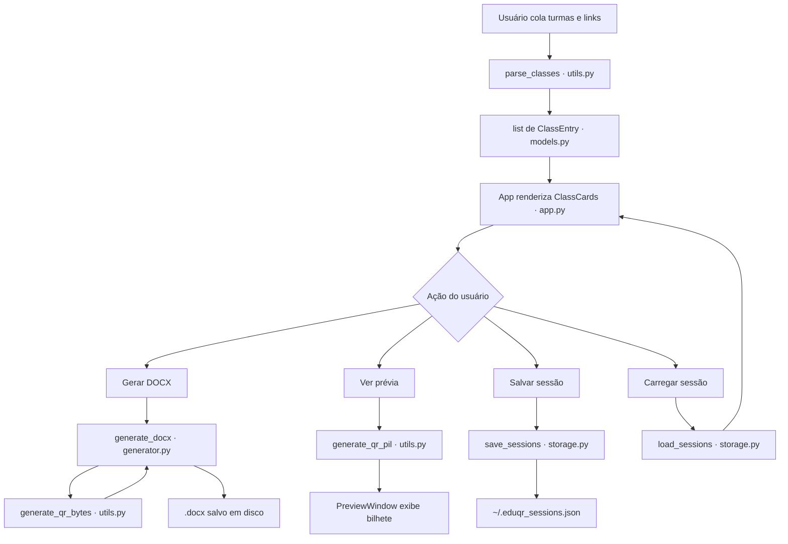

# EduQR — Arquitetura

EduQR gera folhas de bilhetes com QR Code para grupos de WhatsApp, voltado para escolas. Cada bilhete contém um QR Code que abre um link de grupo, um bloco de texto configurável e o nome da turma. A saída é um documento Word paginado pronto para impressão.



---

## Estrutura do projeto

```
eduqr/
├── main.py                 # Ponto de entrada — instancia App e inicia o mainloop
├── requirements.txt
├── eduqr.spec              # Spec do PyInstaller para build de release
└── eduqr/
    ├── __init__.py
    ├── models.py           # Dados puros: apenas definições @dataclass
    ├── utils.py            # Parse de texto e geração de QR (sem UI, sem efeitos colaterais)
    ├── generator.py        # Motor de geração do DOCX
    ├── storage.py          # Persistência JSON das sessões salvas
    └── app.py              # Toda a UI (CustomTkinter)
```

---

## Camadas

### `models.py` — camada de dados

Todo o estado do programa vive aqui como `@dataclass`. Sem lógica, sem imports do próprio projeto.

| Classe | Propósito |
|---|---|
| `TicketTemplate` | Conteúdo textual de um bilhete (título, subtítulo, prefixo do rodapé, toggle) |
| `ClassEntry` | Uma turma: código, link do WhatsApp, quantidade a imprimir, sufixo opcional |
| `GenerationConfig` | Tudo que `generate_docx` precisa: layout, bytes do logo, caminho de saída, template |
| `SavedSession` | Snapshot completo de uma sessão da UI, persistido em disco |

`ClassEntry.display_name` é a única propriedade computada — `"{code} {suffix}".strip()`.

---

### `utils.py` — funções puras

| Função | Entrada → Saída |
|---|---|
| `parse_classes(text, suffix)` | Bloco de texto bruto → `list[ClassEntry]` |
| `generate_qr_bytes(url, logo_bytes?)` | URL + logo opcional → bytes PNG |
| `generate_qr_pil(url, size_px, logo_bytes?)` | URL + tamanho → `Image` PIL (para prévia) |

`parse_classes` espera linhas alternadas: código da turma seguido de link `https://`. Linhas que começam com `http` sem código precedente são ignoradas silenciosamente.

Sobre o logo: é redimensionado para 25% da menor dimensão do QR Code, centralizado com uma caixa branca de 6 px de padding para preservar a leitura. `ERROR_CORRECT_H` é usado quando há logo (maior redundância).

---

### `generator.py` — motor do DOCX

Função pública única: `generate_docx(classes, config, on_progress?)`.

**Cálculo do layout de página:**
- Área imprimível: 19,4 × 28,1 cm (A4 menos 0,8 cm de margem em todos os lados)
- `col_w = PAGE_W / cols`, `row_h = PAGE_H / rows_per_page`
- `qr_cm = min(col_w * 0.55, row_h * 0.52)` — mantém o QR dentro dos limites da célula

**Fluxo por turma:**
1. Gera os bytes do QR uma vez por turma (reutilizado em todas as páginas dela).
2. Calcula `pages = ceil(quantity / tickets_per_page)`.
3. Para cada página: insere quebra de página (exceto a primeira), cria tabela, preenche células.

Células além da contagem de bilhetes ficam em branco (trata o resto da última página).

Todos os helpers OOXML (`_set_cell_borders`, `_set_row_height`, etc.) são funções privadas de módulo — operam diretamente nos objetos do `python-docx`.

`on_progress(current, total, name)` é chamado antes de cada turma e uma vez ao final com `current == total`. A UI usa isso para atualizar a barra de progresso e o label de status.

---

### `storage.py` — persistência

Salva em `~/.eduqr_sessions.json`. Uma função para cada operação: carregar, salvar, deletar. `SavedSession` é serializado como dict plano; `TicketTemplate` como dict aninhado. Chaves ausentes caem em defaults, mantendo compatibilidade com arquivos antigos.

---

### `app.py` — camada de UI

Construído com [CustomTkinter](https://github.com/TomSchimansky/CustomTkinter). Modo: `light`. Paleta de cores verde definida como constantes no topo do módulo.

**Hierarquia de widgets:**

```
App (CTk)
├── Header bar          — marca + botões de sessão
├── Body (grid 2 colunas)
│   ├── Painel esquerdo — campo de texto + entrada de sufixo
│   └── Painel direito  — lista de ClassCards (rolável) + seletor de layout + botão de prévia
└── Footer bar          — seletor de logo, editor de template, barra de progresso, botões gerar/imprimir
```

**Classes principais:**

| Classe | Papel |
|---|---|
| `App` | Janela principal; dono de todo o estado: `_classes`, `_template`, `_logo_bytes`, `_sessions` |
| `ClassCard` | Uma linha no painel direito; dono do spinbox de quantidade; dispara `on_qty_change` na mutação |
| `TemplateEditor` | Modal para editar os campos de `TicketTemplate` |
| `PreviewWindow` | Modal com prévia visual do bilhete; carrega o QR em thread daemon |
| `SessionDialog` | Modal que lista sessões salvas com carregar/deletar |

**Modelo de threads:**

`generate_docx` roda em thread daemon. Atualizações de progresso são enviadas de volta para a thread principal via `self.after(0, callback)`. O botão de gerar fica desabilitado durante a geração. Sem necessidade de locks — a UI só escreve no flag `_generating`, não no estado de geração compartilhado.

---

## Build de release
```bash
pip install pyinstaller
pyinstaller --name EduQR --windowed --onefile main.py
# saída: dist/EduQR.exe
```

Saída: `dist/EduQR.exe` (Windows, arquivo único, sem console).

Se os assets do CustomTkinter estiverem faltando no build, adicione ao `datas` no spec:

```python
import customtkinter
datas = [(os.path.join(os.path.dirname(customtkinter.__file__), "assets"), "customtkinter/assets")]
```

---

## Adicionando funcionalidades

**Novo campo no bilhete** — adicione um atributo em `TicketTemplate`, um `CTkEntry` em `TemplateEditor._build`, conecte em `TemplateEditor._save`, consuma em `generator._fill_ticket_cell`.

**Novo layout** — adicione uma entrada `"label": (cols, rows)` em `LAYOUTS` no `app.py`.

**Formato de saída diferente (ex: PDF)** — crie um novo módulo (ex: `pdf_generator.py`) com a mesma assinatura de `generate_docx`, atualize `_build_config` em `App`, adicione um seletor de formato no footer.
